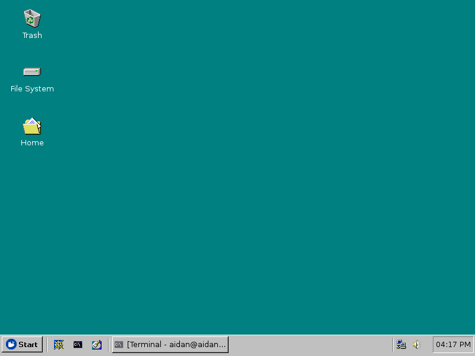
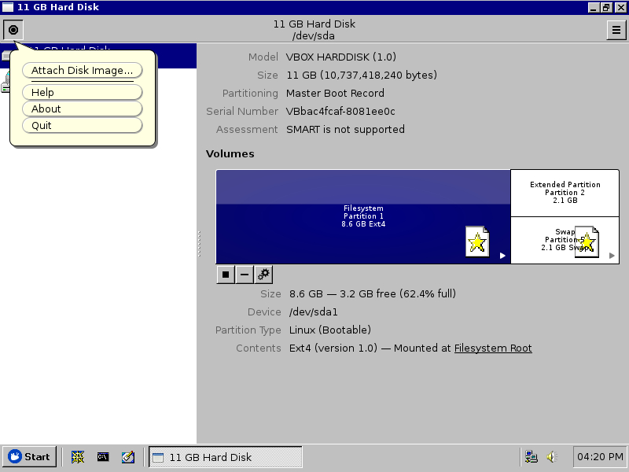
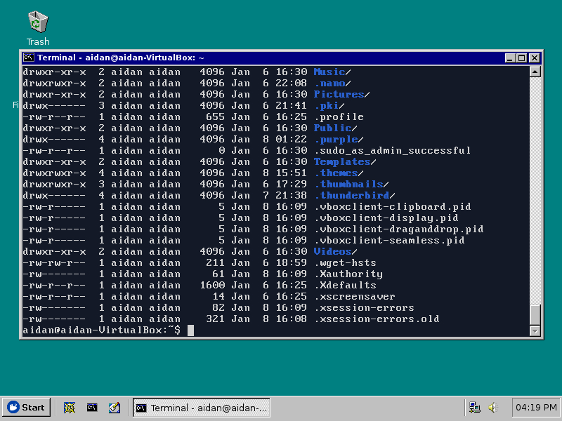
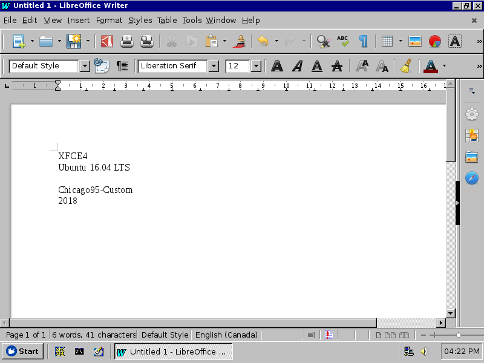
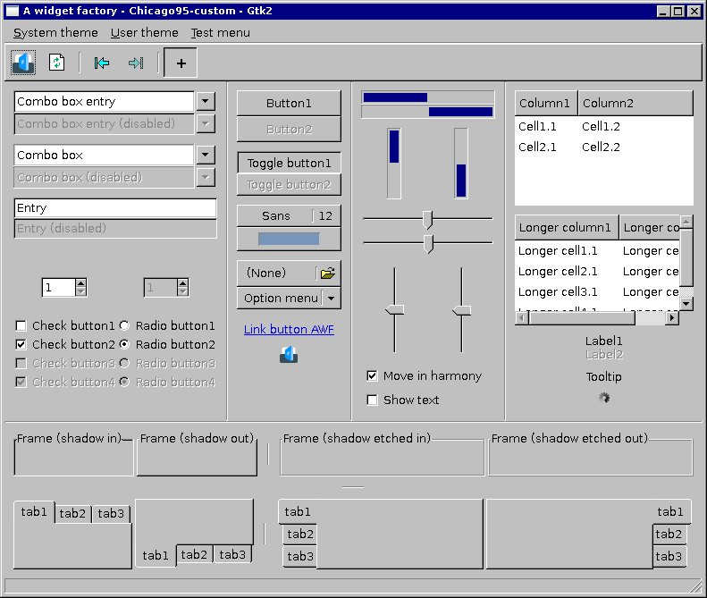
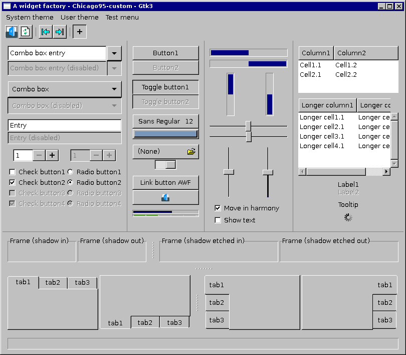
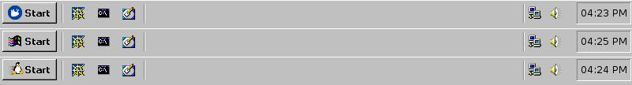

# Chicago95-Custom for XUbuntu 16.04 LTS
This is a customized version of the [Chicago95 GTK theme](https://github.com/grassmunk/Chicago95). This is a theme that I've modified for my own purposes and sharing to you. I don't intend to maintain it indefinitely.

#### Requirements
GTK+ 3.18.9

Xfce 4.12

gtk3-nocsd (See INSTALL.md for setup)

(Preferred distro is Xubuntu 16.04 LTS)

#### Known Issues
Some GTK applications such as Firefox might display inconsistencies such as adopting choice elements of the system theme but attempt to fit them in a flat / material design approach in self drawn interfaces. In regards to visual consistency, this theme may not be perfectly compatible with modern GTK applications.

Libre Office GTK3 doesn't look very good on this theme. I'm not sure why, but I'm trying to fix it. In the mean time you can remove the `libreoffice-gtk3` package which will cause Libre Office to fallback onto GTK2 which is far more consistent and looks better.

#### Screenshots

##### Choice of Start button icons for Whisker and XFCE Application panel menus.

## The reasoning behind disabling Client Side Decorations and fallingback to Server Side Decorations for this theme
I wanted the theme to be usable across both compositing and non-compositing environments, which without compositing effects might cause some GTK3 applications and context menus to either draw a large dark border around the application itself or no border at all (depending on how the theme is setup.) I made the adjustments to compensate for this so that the theme would be usable in non-compositing environments. Due to the adjustments for non-compositing environments, GTK3 applications utilizing Client Side Decorations to draw their own borders would cause a double border effect for users that did use compositing; one border being rendered from the application and the second being rendered by the window manager.

I'm currently unsure of how to make GTK3 applications that are utilizing CSDs to **properly render** a border in the skeuomorphic style of this theme across both compositing and non-compositing environments (If it's even possible.) I find that the window manager is more consistent in correctly rendering borders in both environments compared to CSDs wherein the decision would be left to the application and not the system theme, so I decided to rework parts of the theme around the assumption of forcefully disabling clientside decorations via gtk3-nocsd. Interactive elements in CSD "titlebars" are now themed to appear as a simple toolbar and borders are completely removed while the window manager is only allowed to decorate the application with a traditional titlebar and border, not the application itself; that functionality is now revoked and put back into the control of the theme and the window manager.

## Credits
Grassmunk 4/2016

AdrianoML 12/2016

EMH-Mark-I 4/2017

#### Code and license
License: GPL-3.0+/MIT
