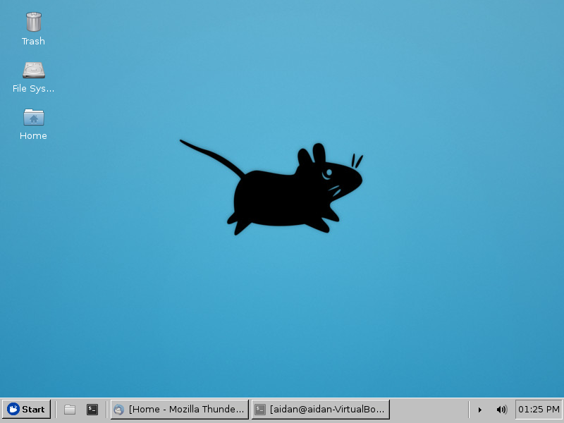
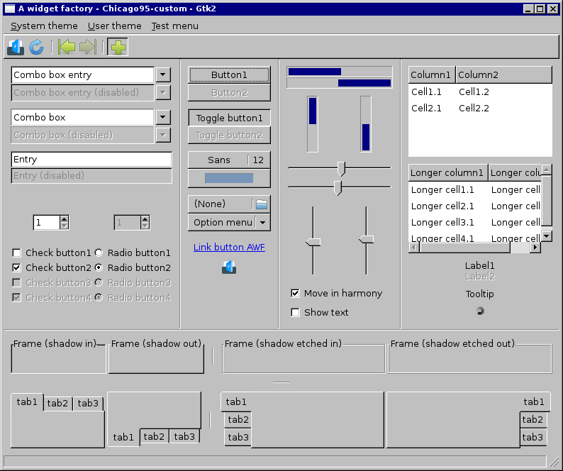
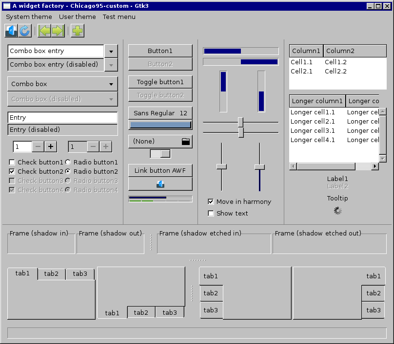

# Chicago95-Custom for XUbuntu 16.04 LTS
This is a customized version of the [Chicago95 GTK theme](https://github.com/grassmunk/Chicago95). This is a theme that I've modified for my own purposes and sharing to you. I don't intend to maintain it indefinitely.

#### Requirements
GTK+ 3.18.9

Xfce 4.12

gtk3-nocsd (See INSTALL.md for setup)

(Preferred distro is Xubuntu 16.04 LTS)

#### Known Issues
GNOME applications such as Disks, Gedit, Software Store, and other GTK3 applications utilizing CSD (Client Side Decorations) won't correctly render the outter borders and titlebars for this theme. (Please read the INSTALL.md for a workaround!)

Thunderbird, FireFox, and potentially other GTK3 applications that I haven’t tested appear to not render menu borders.

#### Screenshots

#### Credits
Grassmunk 4/2016

AdrianoML 12/2016

EMH-Mark-I 4/2017

#### Code and license
License: GPL-3.0+/MIT
