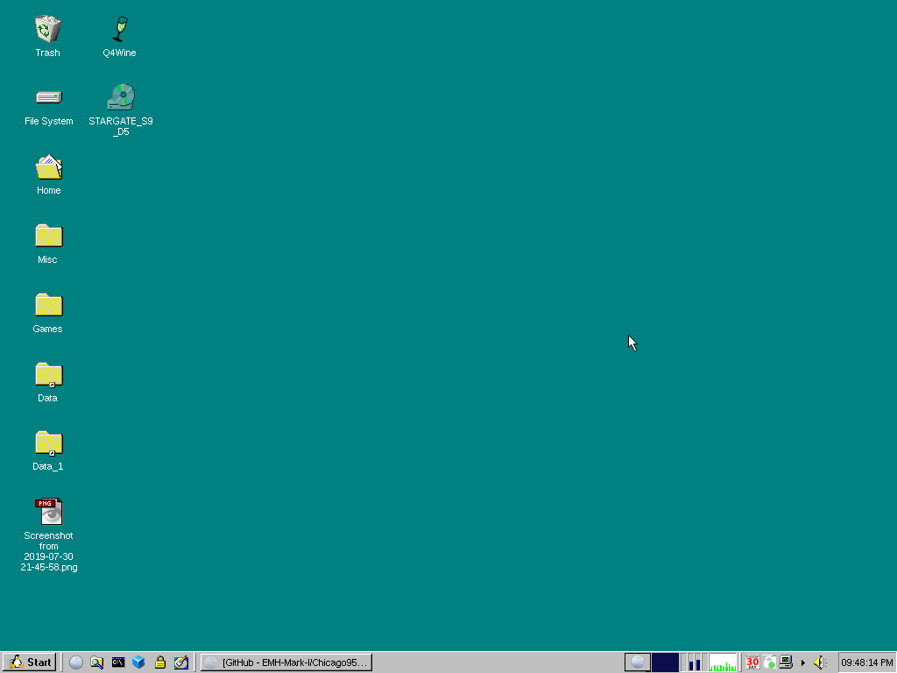

# Chicago95-Custom for XUbuntu 16.04 LTS
This is a customized version of the [Chicago95 GTK theme](https://github.com/grassmunk/Chicago95). This is a theme that I've modified for my own purposes and sharing to you. I don't intend to maintain it indefinitely.

#### Requirements
GTK+ 3.18.9

Xfce 4.12

gtk3-nocsd (See INSTALL.md for setup)

(Preferred distro is Xubuntu 16.04 LTS)

#### Known Issues
Some GTK applications such as Firefox might display inconsistencies such as adopting choice elements of the system theme but attempt to fit them in a flat / material design approach in self drawn interfaces. In regards to visual consistency, this theme may not be perfectly compatible with modern GTK applications.

Libre Office GTK3 doesn't look very good on this theme. I'm not sure why, but I'm trying to fix it. In the mean time you can remove the `libreoffice-gtk3` package which will cause Libre Office to fallback onto GTK2 which is far more consistent and looks better.

## Install the system theme
[Click here](INSTALL.md) for install steps.

#### Screenshots

##### Choice of Start button icons for Whisker and XFCE Application panel menus.

## The reasoning behind disabling Client Side Decorations and fallingback to Server Side Decorations for this theme
I wanted the theme to be usable across both compositing and non-compositing environments. I'm currently unsure of how to make GTK3 applications that are utilizing CSDs to **properly render** a border in the skeuomorphic style of this theme across both compositing and non-compositing environments.

## Credits
Grassmunk 4/2016

AdrianoML 12/2016

EMH-Mark-I 4/2017

#### Code and license
License: GPL-3.0+/MIT
